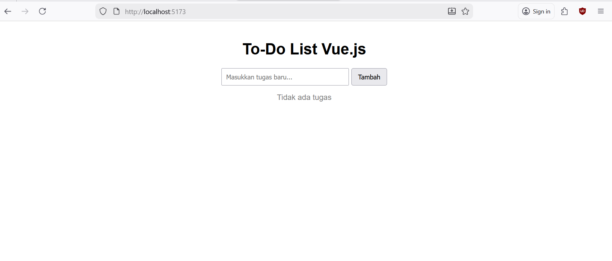
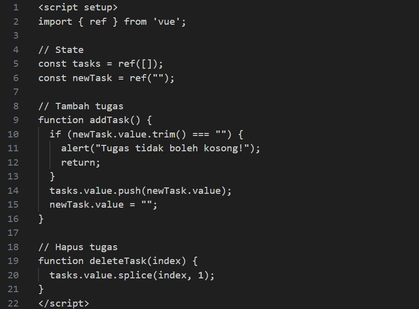
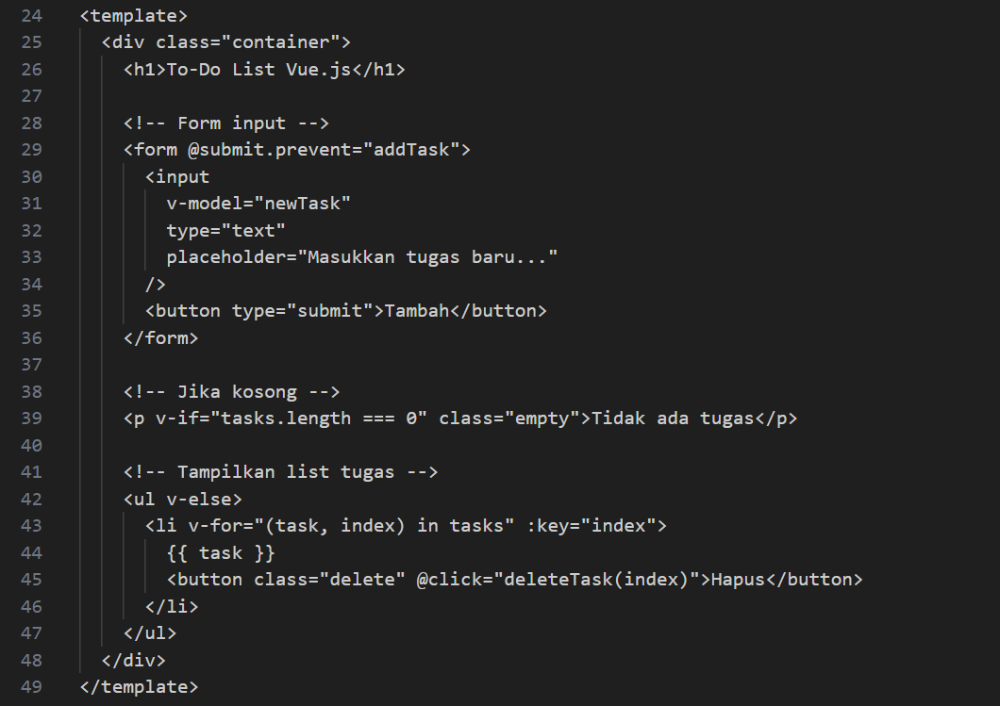

# week12-vue-todo-list

nama = Muhammad Daffa Dzaki Ahnaf
nim = F1D022142

## Deskripsi Tugas
pada tugas ini saya membuat aplikasi To-Do List sederhana menggunakan Vue.js.
Aplikasi memiliki fitur:
- Menambah tugas
- Menghapus tugas
- Menampilkan daftar secara dinamis
- Menampilkan pesan jika daftar kosong
- Menggunakan: ref() untuk state, v-model untuk binding input, v-for untuk looping data, dan @click dan @submit.prevent untuk event handling

## Screenshot Program

tampilan aplikasi

menunjukan program App.vue untuk membuat state dan fungsi

menunjukan program App.vue pada fitur add, delete, render list

## Penjelasan Fungsi Penting
#### addTask()
function addTask() {
  if (newTask.value.trim() === "") return;
  tasks.value.push(newTask.value);
  newTask.value = "";
}
- Mengambil nilai dari newTask
- Mem-push ke dalam tasks
- Mengosongkan input

#### Menampilkan data (v-for)
<li v-for="(task, index) in tasks" :key="index">
  {{ task }}
</li>
Vue akan merender item secara dinamis setiap kali state berubah.

#### Menghapus tugas (deleteTask)
function deleteTask(index) {
  tasks.value.splice(index, 1);
}
Menghapus item berdasarkan index dari array.
